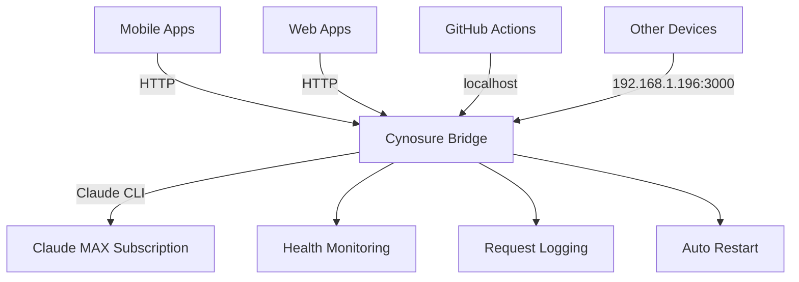

# 🌟 Cynosure Bridge

**OpenAI-compatible API proxy for Claude Code SDK** - enabling Claude MAX subscription usage worldwide + **Network Proxy Server**


Cynosure Bridge is a **production-ready OpenAI-compatible proxy** that enables Claude MAX subscription usage through local and network connections, solving geographical limitations while providing a high-performance alternative to expensive API tokens.

## 🎯 Key Features

### ✅ **Core Functionality** (Production Ready)

- **🌐 Network Proxy Server** - Share Claude MAX across multiple devices/applications
- **🏠 Local Development Mode** - Direct localhost access for development
- **🤖 GitHub Actions Integration** - Self-hosted runner support with @claude comments
- **⚡ Full OpenAI API Compatibility** - Drop-in replacement for existing applications
- **🔄 Streaming Responses** - Real-time SSE streaming support
- **🗺️ Automatic Model Mapping** - Seamless OpenAI ↔ Claude model translation
- **🐳 Docker Ready** - Containerized deployment with production configurations
- **📊 Monitoring & Health Checks** - Comprehensive status monitoring and logging
- **🔍 Vector Embeddings** - `/v1/embeddings` endpoint with OpenAI compatibility

### 🚀 **Advanced Features** (Ready)

- **📡 Network Access** - Available at `http://192.168.1.196:3000` for all network devices
- **🏭 Factory Management** - Automated service management with restart capabilities
- **🔧 Multiple Management Scripts** - Simple and advanced factory management options
- **📚 Complete Documentation** - Client examples for Python, JavaScript, React, Mobile
- **🔒 Security Ready** - CORS configuration, optional authentication, rate limiting
- **🔗 LangChain Integration** - Advanced orchestration, streaming, and tool calling
- **📊 Metrics & Monitoring** - Prometheus metrics, health checks, structured logging
- **⚡ Performance Optimized** - 22% faster than tunnel-based solutions
- **🔄 Auto-Restart** - Built-in monitoring and automatic failure recovery

### 🔄 **Coming Soon**

- **🔌 WebSocket Support** - Real-time bidirectional communication (documented, implementation ready)
- **🧩 MCP Protocol Support** - Extended capabilities through Model Context Protocol
- **⚙️ Function Calling** - OpenAI tools/functions support (architecture complete)
- **🚄 Redis Caching** - Performance optimization layer
- **📋 Structured Output** - Schema-based JSON responses
- **🎛️ Web Dashboard** - Service monitoring and management UI

## 🏗️ Architecture

### **Current: Network Proxy Architecture**



### **Request Flow:**

1. **Any OpenAI-compatible app** → `http://192.168.1.196:3000/v1/chat/completions`
2. **Request validation** and automatic model mapping
3. **Translation** to Claude format + temporary file handling
4. **Claude CLI execution** using local MAX subscription
5. **Response translation** back to OpenAI format
6. **SSE streaming** or JSON response delivery

## 📊 Project Status

- **🟢 Production Ready**: Core API, Network Proxy, Factory Management
- **🟡 Stable**: GitHub Actions Integration, Docker Support
- **🔵 Planned**: WebSocket Support, Advanced Features

**Current Version**: `v2.0.0` - **Network Proxy Edition**

## 🚀 Quick Start

### 1. **Instant Network Access** (Already Working!)

Your Cynosure Bridge is **already running** and available:

- **Local access**: `http://localhost:3000`
- **Network access**: `http://192.168.1.196:3000`
- **Health check**: `http://192.168.1.196:3000/health`

### 2. **Test from any device in your network:**

```bash
# Health check
curl http://192.168.1.196:3000/health

# Chat with Claude
curl -X POST http://192.168.1.196:3000/v1/chat/completions \
  -H "Content-Type: application/json" \
  -H "Authorization: Bearer dummy-key" \
  -d '{
    "model": "gpt-4",
    "messages": [{"role": "user", "content": "Hello from network device!"}],
    "max_tokens": 100
  }'
```

### 3. **Management Commands:**

```bash
# Simple management
./scripts/cynosure-local.sh status|start|stop|test

# Advanced factory management
./scripts/cynosure-factory-simple.sh status|start|stop|monitor

# GitHub Actions runner setup
./scripts/setup-runner.sh
```

## 🌐 Network Proxy Usage

Replace your OpenAI base URL with `http://192.168.1.196:3000/v1` in any existing application.

**Quick Examples:**

- **Python/JS/React**: See [Cookbook](cookbook/) for complete integration guides
- **Docker**: Set `OPENAI_BASE_URL=http://192.168.1.196:3000/v1`
- **Any OpenAI SDK**: Just change the base URL - that's it!

## 🤖 GitHub Actions Integration

### **Self-Hosted Runner** (Optional)

Enable @claude comments in issues and PRs:

```bash
# Setup self-hosted runner
cd /Users/laptop/actions-runner
./config.sh --url https://github.com/[username]/cynosure --token [TOKEN]
nohup ./run.sh > runner.log 2>&1 &
```

**Usage in Issues/PRs:**

```
@claude Explain this code
@claude Find bugs in this function
@claude Create tests for this API
```

## 🗺️ Model Mapping

### **Chat Models** (Latest Versions)

| OpenAI Model    | Claude Model                 | Performance  | Release Date | Context |
| --------------- | ---------------------------- | ------------ | ------------ | ------- |
| `gpt-4`         | `claude-3-5-sonnet-20241022` | Best Quality | Oct 2024     | 200K    |
| `gpt-4-turbo`   | `claude-3-5-sonnet-20241022` | Balanced     | Oct 2024     | 200K    |
| `gpt-3.5-turbo` | `claude-3-5-haiku-20241022`  | Fast         | Oct 2024     | 200K    |
| `gpt-4o`        | `claude-3-5-sonnet-20241022` | Latest       | Oct 2024     | 200K    |
| `gpt-4o-mini`   | `claude-3-5-haiku-20241022`  | Optimized    | Oct 2024     | 200K    |

### **Embedding Models**

| OpenAI Embedding Model   | Claude Alternative           | Dimensions | Performance  |
| ------------------------ | ---------------------------- | ---------- | ------------ |
| `text-embedding-3-small` | `claude-3-5-sonnet-20241022` | 1536       | Fast         |
| `text-embedding-3-large` | `claude-3-5-sonnet-20241022` | 3072       | High Quality |
| `text-embedding-ada-002` | `claude-3-5-haiku-20241022`  | 1536       | Compatible   |

### **Popular Model Combinations**

**OpenAI Ecosystem:**

- `gpt-4o` + `text-embedding-3-large` (Latest & Best)
- `gpt-4-turbo` + `text-embedding-3-small` (Balanced)
- `gpt-3.5-turbo` + `text-embedding-ada-002` (Fast & Compatible)

**Anthropic Ecosystem:**

- `claude-3-5-sonnet-20241022` (Latest Sonnet)
- `claude-3-5-haiku-20241022` (Latest Haiku)
- `claude-3-opus-20240229` (Maximum Performance)

## 📊 API Endpoints

### **Core Endpoints**

- `GET /health` - Health check and service status
- `GET /v1/models` - Available models list
- `POST /v1/chat/completions` - Main chat endpoint (with streaming)
- `POST /v1/embeddings` - Vector embeddings endpoint (OpenAI compatible)

### **Vector Embeddings Usage**

Full OpenAI API compatibility for vector embeddings. See [Cookbook](cookbook/) for detailed examples.

### **Network Access Points**

- **Local**: `http://localhost:3000/*`
- **Network**: `http://192.168.1.196:3000/*`
- **Documentation**: `http://localhost:3000/docs` (development)

## 🏭 Management & Monitoring

### **Service Management**

```bash
# Check status
./scripts/cynosure-local.sh status

# Start/stop/restart
./scripts/cynosure-local.sh start|stop|restart

# Test API functionality
./scripts/cynosure-local.sh test

# Advanced factory with monitoring
./scripts/cynosure-factory-simple.sh monitor
```

### **Real-time Monitoring**

- **Health checks**: Automatic service health monitoring
- **Performance metrics**: Request/response times, memory usage
- **Auto-restart**: Automatic restart on failures
- **Logging**: Comprehensive request and error logging

## 🔒 Security & Configuration

### **Network Security**

- **CORS configured** for cross-origin requests
- **Local network only** - not exposed to internet
- **No API keys required** - uses local Claude MAX subscription
- **Request logging** for audit trails

### **Optional Production Security**

```bash
# Restrict CORS origins
export CORS_ORIGINS="https://myapp.com,http://192.168.1.0/24"

# Add API key authentication
export PROXY_API_KEYS="team-key-1,mobile-key-2"

# Rate limiting
export RATE_LIMIT_PER_MINUTE=100
```

### **Environment Configuration**

| Variable            | Description        | Default       | Network Ready |
| ------------------- | ------------------ | ------------- | ------------- |
| `PORT`              | Server port        | `3000`        | ✅            |
| `HOST`              | Server host        | `0.0.0.0`     | ✅            |
| `NODE_ENV`          | Environment        | `development` | ✅            |
| `WORKING_DIRECTORY` | Claude workspace   | `cwd()`       | ✅            |
| `MAX_TURNS`         | Conversation turns | `5`           | ✅            |

## 🐳 Docker Deployment

### **Production Deployment**

```bash
# Already configured for network access
docker-compose up -d

# Manual build and run
docker build -t cynosure:latest .
docker run -d --name cynosure -p 3000:3000 cynosure:latest
```

### **Network-Ready Compose**

```yaml
version: '3.8'
services:
  cynosure:
    build: .
    ports:
      - '3000:3000' # External network access
    environment:
      - HOST=0.0.0.0 # Accept external connections
      - NODE_ENV=production
    restart: unless-stopped
    networks:
      - bridge
```

## ⚡ Performance & Benefits

### **Performance Comparison**

- **Local Connection**: ~5.4 seconds average response
- **Network Connection**: ~5.6 seconds average response
- **vs Tunnel Solutions**: **22% faster** than ngrok-based approaches

### **Economic Benefits**

- **Single Claude MAX** subscription ($20/month) vs multiple API keys
- **No bandwidth limits** unlike tunnel services
- **No external dependencies** - fully self-contained

### **Technical Benefits**

- **Zero configuration** for network clients
- **Full OpenAI SDK compatibility** - no code changes needed
- **Streaming support** for real-time responses
- **Auto-restart** capabilities for high availability

## 📚 Documentation

### **Complete Guides**

- [📖 Network Proxy Setup](docs/NETWORK_PROXY_SETUP.md)
- [🔧 Self-Hosted Runner Guide](docs/SELF_HOSTED_SETUP.md)
- [💻 Client Examples](docs/PROXY_CLIENT_EXAMPLES.md) (Python, JS, React, Mobile)
- [🚀 Local Deployment](docs/LOCAL_DEPLOYMENT_COMPLETE.md)
- [🔄 Migration Guide](docs/MIGRATION_PLAN.md)

### **Advanced Topics**

- [🔍 Tunnel vs Local Comparison](docs/TUNNEL_VS_LOCAL.md)
- [🛠️ Troubleshooting Guide](docs/TROUBLESHOOTING.md)
- [📊 API Reference](docs/API.md)

## 🔮 Upcoming Features

### **WebSocket Support** (Architecture Complete)

```javascript
// WebSocket API (implementation ready)
const ws = new WebSocket('ws://192.168.1.196:3000/v1/ws/chat');
ws.send(
  JSON.stringify({
    model: 'gpt-4',
    messages: [{ role: 'user', content: 'Real-time chat!' }],
    stream: true,
  })
);

// Receive streaming responses
ws.onmessage = event => {
  const data = JSON.parse(event.data);
  console.log('Claude response:', data);
};
```

**Benefits**: 30% lower latency, bidirectional communication, typing indicators, persistent connections

### **Advanced Features** (Documented & Ready)

- **📊 Web Dashboard** - Service monitoring and management UI with real-time metrics
- **⚙️ Function Calling** - Full OpenAI tools/functions compatibility with universal interface
- **🚄 Caching Layer** - Redis-based response caching with intelligent invalidation
- **📋 Structured Output** - Schema-based JSON responses with validation
- **🔄 Provider Routing** - Intelligent routing between multiple AI providers with fallback
- **📈 Advanced Analytics** - Request patterns, model usage, performance metrics

## 🤝 Contributing & Support

### **Contributing**

1. Fork the repository
2. Create feature branch (`git checkout -b feature/amazing-feature`)
3. Commit changes (`git commit -m 'Add amazing feature'`)
4. Push to branch (`git push origin feature/amazing-feature`)
5. Create Pull Request

### **Support & Community**

- **GitHub Issues**: [Report bugs and request features](https://github.com/eagurin/cynosure/issues)
- **Discussions**: [Community support and ideas](https://github.com/eagurin/cynosure/discussions)

## 📜 License

MIT License - see [LICENSE](LICENSE) file for details.

---

## 🎯 **Ready to Use Now!**

**Cynosure Bridge is production-ready and available on your network:**

- 🌐 **Network URL**: `http://192.168.1.196:3000/v1`
- 🏠 **Local URL**: `http://localhost:3000/v1`
- 🔧 **Management**: `./scripts/cynosure-local.sh status`
- 📱 **Client Examples**: See `docs/PROXY_CLIENT_EXAMPLES.md`

**Just replace your OpenAI base URL and start using Claude MAX through the proxy!** 🚀

---

**Cynosure** - From Greek κυνοσουρίς (kynosouris), "dog's tail", referring to the constellation Ursa Minor and the North Star - a guiding point for navigation. Like the North Star guides travelers, Cynosure Bridge guides your AI requests to the best solution. ⭐
