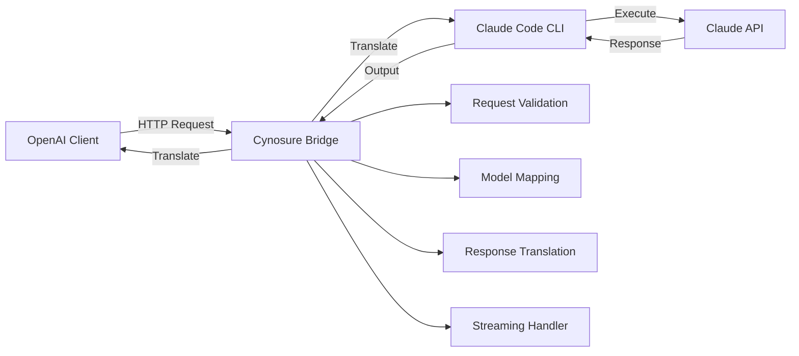

# 🌟 Cynosure Bridge

**OpenAI-compatible API proxy for Claude Code SDK** - enabling Claude MAX subscription usage worldwide


Cynosure Bridge solves the geographical limitations of Claude MAX subscription by creating a local API bridge that's fully compatible with OpenAI API, using Claude Code SDK under the hood.

## 🎯 Key Features

### Core Functionality (✅ Available)

- **Full OpenAI API Compatibility** - Use existing applications without modifications
- **Claude MAX Subscription Support** - Bypass regional limitations through Claude Code SDK
- **Streaming Responses** - Real-time streaming response support
- **Automatic Model Mapping** - Seamless OpenAI ↔ Claude model translation
- **Docker Ready** - Containerized deployment support
- **Production Ready** - Comprehensive CI/CD, testing, and documentation

### Planned Features (🔄 Coming Soon)

- **MCP Protocol Support** - Extended capabilities through Model Context Protocol ([#24](https://github.com/eagurin/cynosure/issues/24))
- **Embeddings Endpoint** - `/v1/embeddings` support ([#13](https://github.com/eagurin/cynosure/issues/13))
- **Function Calling** - OpenAI tools/functions support ([#17](https://github.com/eagurin/cynosure/issues/17))
- **Redis Caching** - Performance optimization layer ([#16](https://github.com/eagurin/cynosure/issues/16))
- **API Authentication** - Secure API key management ([#15](https://github.com/eagurin/cynosure/issues/15))
- **Context Awareness** - Project structure understanding ([#26](https://github.com/eagurin/cynosure/issues/26))
- **Git Integration** - Automatic Git repository operations ([#27](https://github.com/eagurin/cynosure/issues/27))

## 🏗️ Architecture



**Request Flow:**

1. OpenAI-compatible request → Fastify server
2. Request validation and model mapping
3. Translation to Claude format
4. Claude CLI execution with temp files
5. Response translation back to OpenAI format
6. SSE streaming or JSON response

## 📊 Project Status

- **🟢 Stable**: Core API functionality, Docker support
- **🟡 Beta**: CI/CD pipeline, documentation
- **🔴 Alpha**: Advanced features (MCP, caching, auth)

**Current Version**: `v1.0.0` ([Changelog](https://github.com/eagurin/cynosure/releases))

## 🚀 Quick Start

### 1. Установка

```bash
# Клонируем репозиторий
git clone https://github.com/your-org/cynosure.git
cd cynosure

# Устанавливаем зависимости
npm install

# Устанавливаем Claude Code CLI глобально
npm install -g @anthropic-ai/claude-code
```

### 2. Конфигурация

```bash
# Копируем example конфиг
cp .env.example .env

# Редактируем конфигурацию
nano .env
```

**Минимальная конфигурация:**

```env
ANTHROPIC_API_KEY=sk-ant-your-api-key-here
PORT=3000
```

### 3. Запуск

```bash
# Development режим
npm run dev

# Production режим
npm run build
npm start

# Через Docker
docker-compose up
```

## 📡 Использование

### Как OpenAI API замена

Просто измените base URL в вашем приложении:

```javascript
// Вместо
const openai = new OpenAI({
  baseURL: 'https://api.openai.com/v1',
});

// Используйте
const openai = new OpenAI({
  baseURL: 'http://localhost:3000/v1',
});
```

### Примеры запросов

**Chat Completions:**

```bash
curl -X POST http://localhost:3000/v1/chat/completions \\
  -H "Content-Type: application/json" \\
  -d '{
    "model": "gpt-4",
    "messages": [
      {"role": "user", "content": "Explain this code structure"}
    ],
    "stream": false
  }'
```

**Streaming:**

```bash
curl -X POST http://localhost:3000/v1/chat/completions \\
  -H "Content-Type: application/json" \\
  -d '{
    "model": "gpt-4",
    "messages": [
      {"role": "user", "content": "Create a FastAPI app"}
    ],
    "stream": true
  }'
```

## 🗺️ Маппинг моделей

| OpenAI Model    | Claude Model                 | Описание                        |
| --------------- | ---------------------------- | ------------------------------- |
| `gpt-4`         | `claude-3-opus-20240229`     | Максимальная производительность |
| `gpt-4-turbo`   | `claude-3-sonnet-20240229`   | Баланс скорости и качества      |
| `gpt-3.5-turbo` | `claude-3-haiku-20240307`    | Быстрые ответы                  |
| `gpt-4o`        | `claude-3-5-sonnet-20241022` | Последняя версия                |
| `gpt-4o-mini`   | `claude-3-5-haiku-20241022`  | Оптимизированная версия         |

## 🏗️ Архитектура

```bash
┌─────────────────┐    ┌──────────────────┐    ┌─────────────────┐
│   Your App     │    │  Cynosure Bridge │    │  Claude Code    │
│                │────▶│                  │────▶│     SDK         │
│ (OpenAI API)   │    │ Translation Layer│    │                 │
└─────────────────┘    └──────────────────┘    └─────────────────┘
                                │                        │
                                ▼                        ▼
                       ┌──────────────────┐    ┌─────────────────┐
                       │   HTTP Server    │    │ Claude MAX      │
                       │   (Fastify)      │    │                 │
                       └──────────────────┘    └─────────────────┘
```

### Компоненты системы

1. **HTTP Server** - Fastify сервер с OpenAI-совместимыми эндпоинтами
2. **Translation Layer** - Конвертация между форматами OpenAI ↔ Claude
3. **Claude Code Client** - Wrapper для Claude Code SDK
4. **Streaming Handler** - Обработка потоковых ответов
5. **Error Handler** - Централизованная обработка ошибок

## 📊 API Endpoints

### Health Check

```bash
GET /health
```

### Models List

```bash
GET /v1/models
```

### Chat Completions

```bash
POST /v1/chat/completions
```

### API Documentation

```bash
GET /docs (development only)
```

## ⚙️ Конфигурация

### Environment Variables

| Variable            | Description            | Default         | Required |
| ------------------- | ---------------------- | --------------- | -------- |
| `ANTHROPIC_API_KEY` | Claude API Key         | -               | ✅       |
| `PORT`              | Server port            | `3000`          | ❌       |
| `HOST`              | Server host            | `0.0.0.0`       | ❌       |
| `NODE_ENV`          | Environment            | `development`   | ❌       |
| `LOG_LEVEL`         | Log level              | `info`          | ❌       |
| `WORKING_DIRECTORY` | Project directory      | `process.cwd()` | ❌       |
| `MAX_TURNS`         | Max conversation turns | `5`             | ❌       |
| `TIMEOUT`           | Request timeout (ms)   | `300000`        | ❌       |

### MCP Configuration

Cynosure поддерживает Model Context Protocol для расширенных возможностей:

```json
{
  "mcpServers": {
    "filesystem": {
      "command": "npx",
      "args": ["-y", "@modelcontextprotocol/server-filesystem", "/path/to/project"],
      "env": {}
    },
    "git": {
      "command": "npx",
      "args": ["-y", "@modelcontextprotocol/server-git", "/path/to/repo"],
      "env": {}
    }
  }
}
```

## 🔧 Development

### Scripts

```bash
npm run dev          # Development with hot reload
npm run build        # TypeScript compilation
npm run start        # Production server
npm run test         # Run tests
npm run test:e2e     # E2E tests
npm run lint         # ESLint check
npm run lint:fix     # ESLint auto-fix
npm run format       # Prettier formatting
npm run typecheck    # TypeScript type checking
```

### Project Structure

```bash
cynosure/
├── src/
│   ├── server/           # HTTP server & routes
│   ├── translation/      # OpenAI ↔ Claude conversion
│   ├── claude/           # Claude Code SDK integration
│   ├── models/           # Type definitions
│   └── utils/            # Helper functions
├── config/               # Configuration files
├── docker/               # Docker setup
├── docs/                 # Documentation
├── tests/                # Test suites
└── scripts/              # Build & deployment scripts
```

## 🐳 Docker Deployment

### Development

```bash
docker-compose up -d
```

### Production

```bash
# Build image
docker build -t cynosure:latest .

# Run container
docker run -d \\
  --name cynosure \\
  -p 3000:3000 \\
  -e ANTHROPIC_API_KEY=your-key \\
  cynosure:latest
```

### Docker Compose

```yaml
version: '3.8'
services:
  cynosure:
    build: .
    ports:
      - '3000:3000'
    environment:
      - ANTHROPIC_API_KEY=sk-ant-your-key
      - NODE_ENV=production
    restart: unless-stopped
```

## 🧪 Testing

### Unit Tests

```bash
npm run test
```

### Integration Tests

```bash
npm run test:integration
```

### E2E Tests

```bash
npm run test:e2e
```

### Manual Testing

```bash
# Test health endpoint
curl http://localhost:3000/health

# Test chat completion
curl -X POST http://localhost:3000/v1/chat/completions \\
  -H "Content-Type: application/json" \\
  -d '{"model": "gpt-4", "messages": [{"role": "user", "content": "Hello"}]}'
```

## 📈 Monitoring & Logging

### Logs

```bash
# View logs in development
npm run dev

# View Docker logs
docker logs cynosure

# Follow logs
docker logs -f cynosure
```

### Metrics

- Request/response times
- Error rates
- Token usage
- Claude Code SDK performance

## 🔒 Security

### Best Practices

- Храните `ANTHROPIC_API_KEY` в безопасности
- Используйте HTTPS в production
- Ограничьте доступ к API
- Мониторьте использование токенов
- Регулярно обновляйте зависимости

### Optional API Authentication

```env
API_KEY=your-secure-api-key
```

Clients must include:

```bash
Authorization: Bearer your-secure-api-key
```

## 🤝 Contributing

1. Fork репозиторий
2. Создайте feature branch (`git checkout -b feature/amazing-feature`)
3. Commit изменения (`git commit -m 'Add amazing feature'`)
4. Push в branch (`git push origin feature/amazing-feature`)
5. Создайте Pull Request

## 📜 License

MIT License - see [LICENSE](LICENSE) file for details.

## 🆘 Support

### Issues & Bugs

- GitHub Issues: [github.com/your-org/cynosure/issues](https://github.com/your-org/cynosure/issues)
- Discussion: [github.com/your-org/cynosure/discussions](https://github.com/your-org/cynosure/discussions)

### Documentation

- [API Reference](docs/API.md)
- [Setup Guide](docs/SETUP.md)
- [Examples](docs/EXAMPLES.md)
- [Troubleshooting](docs/TROUBLESHOOTING.md)

## 🌟 Roadmap

### Phase 1: MVP ✅

- [x] Basic OpenAI API compatibility
- [x] Claude Code SDK integration
- [x] Request/response translation
- [x] Streaming support

### Phase 2: Advanced Features

- [ ] Function calling support
- [ ] Advanced model mapping
- [ ] Enhanced error handling
- [ ] Performance optimizations

### Phase 3: Production Ready

- [ ] Load balancing
- [ ] Rate limiting
- [ ] Advanced monitoring
- [ ] Security hardening

### Phase 4: Extensions

- [ ] Web UI dashboard
- [ ] Plugin system
- [ ] Multi-instance support
- [ ] Advanced caching

---

**Cynosure** - От греческого κυνοσουρίς (kynosouris), "собачий хвост", имея в виду созвездие Малой Медведицы и Полярную звезду - направляющую точку для навигации. Как Полярная звезда направляет путешественников, Cynosure Bridge направляет ваши AI запросы к лучшему решению. ⭐
